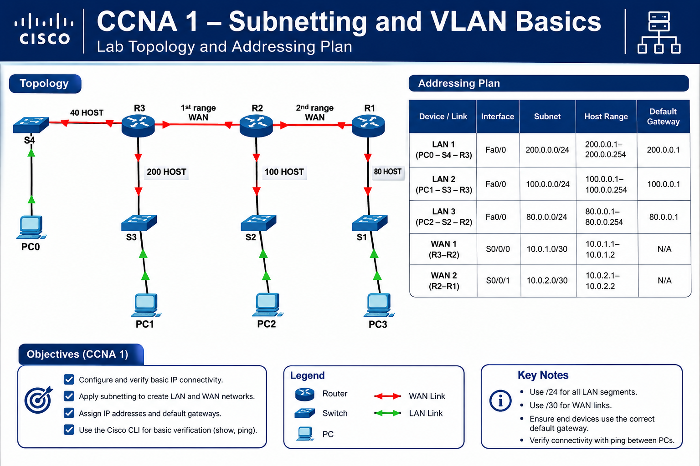
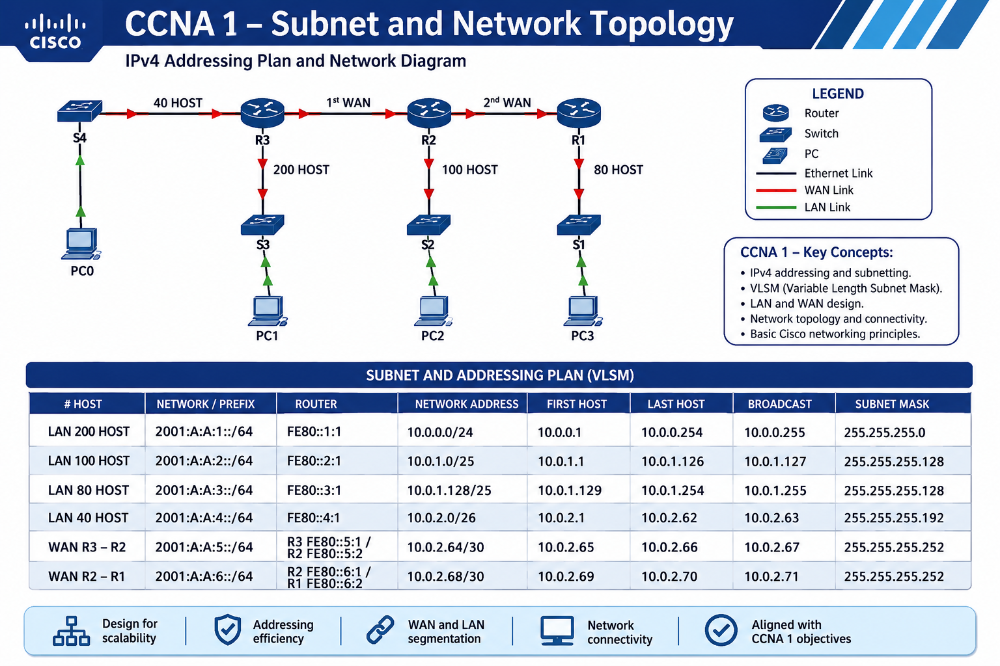

# 🌐 CCNA 1 — Comprehensive Subnetting, VLSM & Network Configuration Lab

> **Cisco Networking Academy / CCNA 1 Practical Skills Lab**  
> IPv4 • IPv6 • VLSM • Static Routing • SSHv2 • Network Security • Cisco IOS


---

## 📌 Overview

This repository contains a complete **CCNA 1 networking laboratory environment** designed to demonstrate practical skills in IPv4/IPv6 addressing, VLSM subnetting, Cisco IOS configuration, static routing, network security hardening, and secure remote administration.

The lab simulates a multi-router enterprise network consisting of:

- **3 Cisco Routers:** R1, R2, R3
- **4 Cisco Switches:** S1, S2, S3, S4
- **4 End Devices:** PC0, PC1, PC2, PC3
- Multiple LAN segments with different host requirements
- Two point-to-point WAN connections
- IPv4 VLSM addressing
- IPv6 /64 addressing
- Static IPv4 and IPv6 routing
- SSHv2 remote management
- Basic Cisco IOS security hardening

The objective is to build a fully functional network while applying **efficient IP addressing, segmentation, routing, security, and verification techniques**.

---

# 🗺️ Network Topology

The following topology represents the physical and logical structure of the laboratory:

### Network Structure




```

---

# 🧩 Lab Requirements

| Device | Quantity | Role |
|---|---:|---|
| Cisco Routers | 3 | Inter-LAN and WAN routing |
| Cisco Switches | 4 | LAN connectivity |
| End Devices | 4 | Network testing |
| LAN Networks | 4 | User segments |
| WAN Links | 2 | Router-to-router connectivity |
| IPv4 | Yes | VLSM addressing |
| IPv6 | Yes | /64 addressing |
| SSHv2 | Yes | Secure management |
| Static Routing | Yes | IPv4/IPv6 connectivity |

---

# 📐 IPv4 VLSM Addressing Plan

VLSM (**Variable Length Subnet Masking**) is used to allocate address space according to the number of hosts required by each network.

The networks were designed from the largest host requirement to the smallest:

| Network | Hosts Required | Network | Prefix | Usable Range | Broadcast |
|---|---:|---|---|---|---|
| LAN 200 | 200 | `10.0.0.0` | `/24` | `10.0.0.1 – 10.0.0.254` | `10.0.0.255` |
| LAN 100 | 100 | `10.0.1.0` | `/25` | `10.0.1.1 – 10.0.1.126` | `10.0.1.127` |
| LAN 80 | 80 | `10.0.1.128` | `/25` | `10.0.1.129 – 10.0.1.254` | `10.0.1.255` |
| LAN 40 | 40 | `10.0.2.0` | `/26` | `10.0.2.1 – 10.0.2.62` | `10.0.2.63` |
| WAN R3–R2 | 2 | `10.0.2.64` | `/30` | `10.0.2.65 – 10.0.2.66` | `10.0.2.67` |
| WAN R2–R1 | 2 | `10.0.2.68` | `/30` | `10.0.2.69 – 10.0.2.70` | `10.0.2.71` |

### Subnet Masks

```text
/24 → 255.255.255.0
/25 → 255.255.255.128
/26 → 255.255.255.192
/30 → 255.255.255.252
```

---

# 🌎 IPv6 Addressing Plan

Each LAN and WAN segment receives a dedicated `/64` IPv6 prefix.

| Network | IPv6 Prefix | Router / Link-Local |
|---|---|---|
| LAN 200 | `2001:A:A:1::/64` | `FE80::1:1` |
| LAN 100 | `2001:A:A:2::/64` | `FE80::2:1` |
| LAN 80 | `2001:A:A:3::/64` | `FE80::3:1` |
| LAN 40 | `2001:A:A:4::/64` | `FE80::4:1` |
| WAN R3–R2 | `2001:A:A:5::/64` | `FE80::5:1 / FE80::5:2` |
| WAN R2–R1 | `2001:A:A:6::/64` | `FE80::6:1 / FE80::6:2` |

IPv6 routing is enabled on all routers using:

```cisco
ipv6 unicast-routing
```

---

# 🖥️ Router Addressing

## R3

### LAN 200

```text
IPv4:       10.0.0.1/24
IPv6:       2001:A:A:1::1/64
Link-local: FE80::1:1
```

### LAN 40

```text
IPv4:       10.0.2.1/26
IPv6:       2001:A:A:4::1/64
Link-local: FE80::4:1
```

### WAN R3–R2

```text
IPv4:       10.0.2.65/30
IPv6:       2001:A:A:5::1/64
Link-local: FE80::5:1
```

---

## R2

### LAN 100

```text
IPv4:       10.0.1.1/25
IPv6:       2001:A:A:2::1/64
Link-local: FE80::2:1
```

### WAN R3–R2

```text
IPv4:       10.0.2.66/30
IPv6:       2001:A:A:5::2/64
Link-local: FE80::5:2
```

### WAN R2–R1

```text
IPv4:       10.0.2.69/30
IPv6:       2001:A:A:6::1/64
Link-local: FE80::6:1
```

---

## R1

### LAN 80

```text
IPv4:       10.0.1.129/25
IPv6:       2001:A:A:3::1/64
Link-local: FE80::3:1
```

### WAN R2–R1

```text
IPv4:       10.0.2.70/30
IPv6:       2001:A:A:6::2/64
Link-local: FE80::6:2
```

---

# 🔐 Security Hardening

Security controls were implemented on the edge devices to reduce the attack surface and protect administrative access.

## Password Policy

A minimum password length is enforced:

```cisco
security passwords min-length 8
```

Brute-force protection is configured using:

```cisco
login block-for 120 attempts 3 within 60
```

This blocks login attempts for **120 seconds** after three failed attempts within a 60-second window.

---

## 🔑 Privileged EXEC Security

Instead of using a plain-text enable password, the lab uses:

```cisco
enable secret <PASSWORD>
```

`enable secret` stores the privileged EXEC password using a stronger hashed representation.

---

## 🔒 Password Encryption

Cisco IOS password obfuscation is enabled with:

```cisco
service password-encryption
```

> **Security note:** This provides basic protection for passwords stored in the configuration. It should not be considered equivalent to modern password hashing.

---

# 🛡️ SSHv2 Remote Management

Remote administration is configured using **SSH version 2** instead of insecure Telnet.

The configuration includes:

```cisco
username soporte secret <PASSWORD>

ip domain-name cisco.com

crypto key generate rsa
1024

ip ssh version 2
```

VTY lines are restricted to SSH:

```cisco
line vty 0 15
transport input ssh
login local
exec-timeout 10 0
```

This provides:

- 🔐 Encrypted remote sessions
- 🚫 Telnet disabled
- 👤 Local user authentication
- ⏱️ Automatic session timeout

---

# ⏱️ Session Security

Console and VTY sessions automatically terminate after 10 minutes of inactivity:

```cisco
exec-timeout 10 0
```

This reduces the risk of an unattended administrative session being exploited.

---

# 🧭 Static Routing

The routers use static routes to establish connectivity between remote LANs.

### R1

```cisco
ip route 0.0.0.0 0.0.0.0 10.0.2.69
ipv6 route ::/0 2001:A:A:6::1
```

### R2

```cisco
ip route 10.0.0.0 255.255.255.0 10.0.2.65
ip route 10.0.2.0 255.255.255.192 10.0.2.65
ip route 10.0.1.128 255.255.255.128 10.0.2.70

ipv6 route 2001:A:A:1::/64 2001:A:A:5::1
ipv6 route 2001:A:A:4::/64 2001:A:A:5::1
ipv6 route 2001:A:A:3::/64 2001:A:A:6::2
```

### R3

```cisco
ip route 0.0.0.0 0.0.0.0 10.0.2.66
ipv6 route ::/0 2001:A:A:5::2
```

---

# 🖧 Switch Management

Each switch is configured with a management address on **VLAN 1**.

| Switch | Management IP | Default Gateway |
|---|---|---|
| S1 | `10.0.1.130/25` | `10.0.1.129` |
| S2 | `10.0.1.2/25` | `10.0.1.1` |
| S3 | `10.0.0.2/24` | `10.0.0.1` |
| S4 | `10.0.2.2/26` | `10.0.2.1` |

Example:

```cisco
interface vlan 1
ip address 10.0.1.130 255.255.255.128
no shutdown
exit

ip default-gateway 10.0.1.129
```

---

# 🧪 Verification & Testing

After configuration, connectivity should be verified from the end devices and network infrastructure.

## IPv4 Connectivity

Example:

```bash
ping 10.0.1.138
```

The objective is to verify end-to-end communication between different LAN segments.

---

## IPv6 Connectivity

Example:

```bash
ping 2001:A:A:3::10
```

This validates IPv6 addressing and routing across the network.

---

# 🔐 SSH Verification

SSH access can be tested from a compatible PC:

```bash
ssh -l soporte 10.0.0.2
```

The connection should establish an encrypted SSHv2 session to S3.

---

# 🔎 Cisco IOS Verification Commands

Useful commands for troubleshooting and validation:

### Interface Status

```cisco
show ip interface brief
```

### IPv6 Interfaces

```cisco
show ipv6 interface brief
```

### IPv4 Routing Table

```cisco
show ip route
```

### IPv6 Routing Table

```cisco
show ipv6 route
```

### Running Configuration

```cisco
show running-config
```

### SSH Status

```cisco
show ip ssh
```

### SSH Sessions

```cisco
show users
```

### Interface Details

```cisco
show interfaces
```

---

# 📊 Skills Demonstrated

This project demonstrates practical knowledge in:

| Category | Skills |
|---|---|
| 🌐 IPv4 | Addressing, subnetting, VLSM |
| 🌎 IPv6 | Global unicast, `/64`, link-local addresses |
| 🧭 Routing | Static IPv4/IPv6 routing |
| 🔗 WAN | Point-to-point `/30` networks |
| 🖧 LAN | Segmentation and host addressing |
| 🔐 Security | Password policies and brute-force protection |
| 🛡️ Remote Access | SSHv2 and local authentication |
| ⏱️ Access Control | Console/VTY session timeouts |
| 💻 Cisco IOS | CLI configuration and verification |
| 🧪 Troubleshooting | Ping, routing and interface verification |

---

# 🎯 Learning Objectives

By completing this laboratory, the following CCNA fundamentals are practiced:

- Understand IPv4 addressing and subnetting.
- Design a VLSM addressing scheme.
- Calculate network, host and broadcast addresses.
- Configure IPv4 addresses on Cisco routers.
- Configure IPv6 global and link-local addresses.
- Configure static IPv4 and IPv6 routes.
- Build LAN and WAN network segments.
- Configure switch management interfaces.
- Implement basic Cisco IOS security controls.
- Configure SSHv2 for secure remote administration.
- Verify end-to-end IPv4/IPv6 connectivity.
- Troubleshoot common Layer 2 and Layer 3 connectivity issues.

---

# 🚀 Conclusion

This laboratory combines **subnetting, VLSM, IPv4, IPv6, routing, Cisco IOS administration, network security and SSHv2** into a single practical environment.

It provides a foundation for understanding how multiple LANs and WAN links can be designed, addressed, secured and interconnected using Cisco networking technologies.

> **CCNA 1 Focus:** Build it. Address it. Route it. Secure it. Verify it.

---

## 👨‍💻 Project Focus

**Networking • Cisco IOS • CCNA 1 • VLSM • IPv4 • IPv6 • Static Routing • SSHv2 • Network Security**

---
