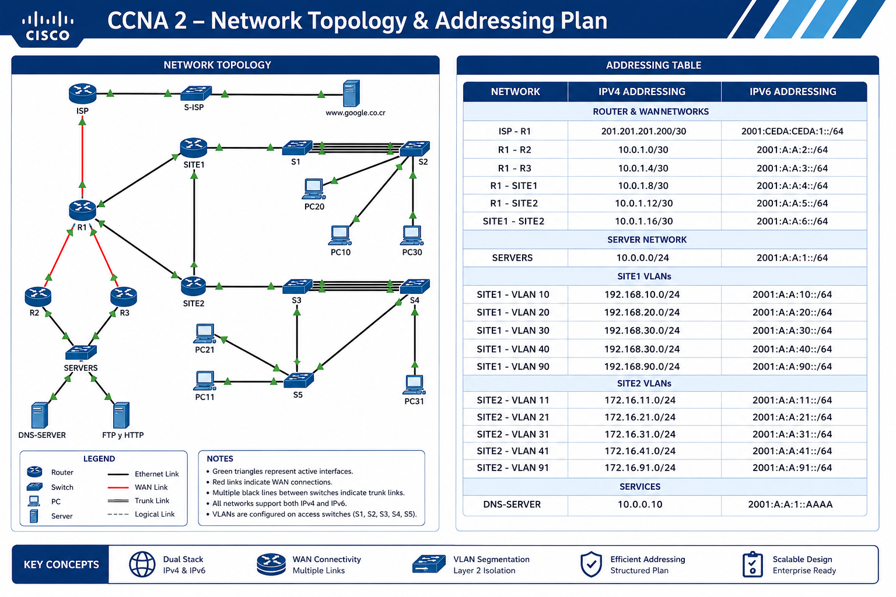

# 🌐 CCNA 2 — Enterprise Switching, Routing & Wireless Essentials

## Cisco Networking Academy — Final Practical Skills Assessment

**IPv4 • IPv6 • VLANs • EtherChannel • HSRPv2 • DHCP • Static Routing • Layer 2 Security • Cisco IOS**

---

## 📌 Overview

This repository contains the complete implementation of a **CCNA 2: Switching, Routing, and Wireless Essentials (SRWE) Final Skills Assessment** laboratory.

The project simulates a multi-site enterprise network using IPv4/IPv6 dual-stack addressing, VLAN segmentation, redundant routing, first-hop redundancy, dynamic addressing, EtherChannel, and Layer 2 security.

### Network Components

- **1 ISP Router**
- **4 Enterprise Routers:** R1, R2, R3, SITE1
- **1 Layer 3 Switch:** SITE2
- **7 Layer 2 Switches:** S1, S2, S3, S4, S5, SERVERS
- **Multiple VLANs**
- **IPv4 and IPv6 dual-stack**
- **HSRPv2**
- **LACP and PAgP EtherChannel**
- **Rapid-PVST+**
- **DHCPv4**
- **Stateful and Stateless DHCPv6**
- **Static and Floating Static Routes**
- **Router-on-a-Stick**
- **Layer 3 Inter-VLAN Routing**
- **Port Security**
- **Sticky MAC addresses**
- **BPDU Guard**
- **PortFast**
- **DTP disabled using `switchport nonegotiate`**

---

# 🗺️ Network Topology



---

# 🧩 Network Architecture

The topology is divided into two main enterprise sites:

### SITE1
- Router-on-a-Stick
- VLANs 10, 20, 30, 40 and 90
- IPv4 DHCP relay
- Stateless DHCPv6
- S1 and S2 access switches
- LACP EtherChannel

### SITE2
- Layer 3 switching
- VLANs 11, 21, 31, 41 and 91
- SVI-based Inter-VLAN routing
- Stateful DHCPv6
- S3, S4 and S5 access switches
- PAgP EtherChannel

### Core
- R1 as the central router
- R2/R3 redundant routers
- HSRPv2 for gateway redundancy
- Redundant WAN paths
- Floating static routes

---

# 📐 Addressing Plan

| Segment | IPv4 Network | IPv6 Network | Gateway / Role |
|---|---|---|---|
| ISP – R1 | 201.201.201.200/30 | 2001:CEDA:CEDA:1::/64 | WAN |
| R1 – R2 | 10.0.1.0/30 | 2001:A:A:2::/64 | Core Link |
| R1 – R3 | 10.0.1.4/30 | 2001:A:A:3::/64 | Core Link |
| R1 – SITE1 | 10.0.1.8/30 | 2001:A:A:4::/64 | Distribution |
| R1 – SITE2 | 10.0.1.12/30 | 2001:A:A:5::/64 | Distribution |
| SITE1 – SITE2 | 10.0.1.16/30 | 2001:A:A:6::/64 | Backup Link |
| SERVERS | 10.0.0.0/24 | 2001:A:A:1::/64 | 10.0.0.1 HSRP |
| SITE1 VLAN 10 | 192.168.10.0/24 | 2001:A:A:10::/64 | 192.168.10.1 |
| SITE1 VLAN 20 | 192.168.20.0/24 | 2001:A:A:20::/64 | 192.168.20.1 |
| SITE1 VLAN 30 | 192.168.30.0/24 | 2001:A:A:30::/64 | 192.168.30.1 |
| SITE1 VLAN 40 | 192.168.40.0/24 | 2001:A:A:40::/64 | 192.168.40.1 |
| SITE1 VLAN 90 | 192.168.90.0/24 | 2001:A:A:90::/64 | Native |
| SITE2 VLAN 11 | 172.16.11.0/24 | 2001:A:A:11::/64 | 172.16.11.1 |
| SITE2 VLAN 21 | 172.16.21.0/24 | 2001:A:A:21::/64 | 172.16.21.1 |
| SITE2 VLAN 31 | 172.16.31.0/24 | 2001:A:A:31::/64 | 172.16.31.1 |
| SITE2 VLAN 41 | 172.16.41.0/24 | 2001:A:A:41::/64 | 172.16.41.1 |
| SITE2 VLAN 91 | 172.16.91.0/24 | 2001:A:A:91::/64 | Native |

---

# ⚙️ Device Configurations

## ISP — Internet Edge Router

```cisco
enable
configure terminal

hostname ISP

interface GigabitEthernet0/0/0
 ip address 201.201.201.202 255.255.255.252
 ipv6 address fe80::1:2 link-local
 ipv6 address 2001:CEDA:CEDA:1::2/64
 no shutdown
 exit

interface GigabitEthernet0/0/1
 ip address 200.100.100.1 255.255.255.252
 no shutdown
 exit

ipv6 unicast-routing

end
write memory
```

---

# R1 — Core Router

```cisco
enable
configure terminal

hostname R1

ipv6 unicast-routing

! =========================
! WAN INTERFACE TO ISP
! =========================

interface GigabitEthernet0/0/0
 description LINK_TO_ISP
 ip address 201.201.201.201 255.255.255.252
 ipv6 address fe80::1:1 link-local
 ipv6 address 2001:CEDA:CEDA:1::1/64
 no shutdown
 exit

! =========================
! LINK TO R2
! =========================

interface GigabitEthernet0/1/0
 description LINK_TO_R2
 ip address 10.0.1.1 255.255.255.252
 ipv6 address fe80::2:1 link-local
 ipv6 address 2001:A:A:2::1/64
 no shutdown
 exit

! =========================
! LINK TO R3
! =========================

interface GigabitEthernet0/2/0
 description LINK_TO_R3
 ip address 10.0.1.5 255.255.255.252
 ipv6 address fe80::3:1 link-local
 ipv6 address 2001:A:A:3::1/64
 no shutdown
 exit

! =========================
! LINK TO SITE1
! =========================

interface GigabitEthernet0/0
 description LINK_TO_SITE1
 ip address 10.0.1.9 255.255.255.252
 ipv6 address fe80::4:1 link-local
 ipv6 address 2001:A:A:4::1/64
 no shutdown
 exit

! =========================
! LINK TO SITE2
! =========================

interface GigabitEthernet0/1
 description LINK_TO_SITE2
 ip address 10.0.1.13 255.255.255.252
 ipv6 address fe80::5:1 link-local
 ipv6 address 2001:A:A:5::1/64
 no shutdown
 exit

! =========================
! DHCPv4
! =========================

ip dhcp excluded-address 192.168.10.1 192.168.10.10
ip dhcp excluded-address 172.16.11.1 172.16.11.11

ip dhcp pool VLAN10
 network 192.168.10.0 255.255.255.0
 default-router 192.168.10.1
 dns-server 10.0.0.10
 domain-name miempresa.com
 exit

ip dhcp pool VLAN11
 network 172.16.11.0 255.255.255.0
 default-router 172.16.11.1
 dns-server 10.0.0.10
 domain-name miempresa.com
 exit

! =========================
! IPv4 STATIC ROUTES
! =========================

ip route 192.168.0.0 255.255.192.0 GigabitEthernet0/0 10.0.1.10
ip route 192.168.0.0 255.255.192.0 GigabitEthernet0/1/0 5

ip route 172.16.0.0 255.255.0.0 GigabitEthernet0/1 10.0.1.14
ip route 172.16.0.0 255.255.0.0 GigabitEthernet0/0 5

ip route 10.0.0.0 255.255.255.0 GigabitEthernet0/1/0 10.0.1.2
ip route 10.0.0.0 255.255.255.0 GigabitEthernet0/2/0 10.0.1.6

ip route 0.0.0.0 0.0.0.0 GigabitEthernet0/0/0

! =========================
! IPv6 STATIC ROUTES
! =========================

ipv6 route 2001:A:A:10::/64 GigabitEthernet0/0 fe80::4:2
ipv6 route 2001:A:A:10::/64 GigabitEthernet0/1/0 fe80::2:2 5

ipv6 route 2001:A:A:20::/64 GigabitEthernet0/0 fe80::4:2
ipv6 route 2001:A:A:20::/64 GigabitEthernet0/1/0 fe80::2:2 5

ipv6 route 2001:A:A:30::/64 GigabitEthernet0/0 fe80::4:2
ipv6 route 2001:A:A:30::/64 GigabitEthernet0/1/0 fe80::2:2 5

ipv6 route 2001:A:A:40::/64 GigabitEthernet0/0 fe80::4:2
ipv6 route 2001:A:A:40::/64 GigabitEthernet0/1/0 fe80::2:2 5

ipv6 route 2001:A:A:11::/64 GigabitEthernet0/1 fe80::5:2
ipv6 route 2001:A:A:11::/64 GigabitEthernet0/0 fe80::4:2 5

ipv6 route 2001:A:A:21::/64 GigabitEthernet0/1 fe80::5:2
ipv6 route 2001:A:A:21::/64 GigabitEthernet0/0 fe80::4:2 5

ipv6 route 2001:A:A:31::/64 GigabitEthernet0/1 fe80::5:2
ipv6 route 2001:A:A:31::/64 GigabitEthernet0/0 fe80::4:2 5

ipv6 route 2001:A:A:41::/64 GigabitEthernet0/1 fe80::5:2
ipv6 route 2001:A:A:41::/64 GigabitEthernet0/0 fe80::4:2 5

ipv6 route 2001:A:A:1::/64 GigabitEthernet0/1/0 fe80::2:2
ipv6 route 2001:A:A:1::/64 GigabitEthernet0/2/0 fe80::3:2

ipv6 route ::/0 GigabitEthernet0/0/0

end
write memory
```

---

# R2 — HSRP Router

```cisco
enable
configure terminal

hostname R2

ipv6 unicast-routing

! =========================
! LINK TO R1
! =========================

interface GigabitEthernet0/1/0
 description LINK_TO_R1
 ip address 10.0.1.2 255.255.255.252
 ipv6 address fe80::2:2 link-local
 ipv6 address 2001:A:A:2::2/64
 no shutdown
 exit

! =========================
! LINK TO SERVERS
! =========================

interface GigabitEthernet0/0
 description LINK_TO_SERVERS
 ip address 10.0.0.2 255.255.255.0
 ipv6 address fe80::1:2 link-local
 ipv6 address 2001:A:A:1::2/64

 standby version 2
 standby 4 ip 10.0.0.1
 standby 6 ipv6 FE80::1

 no shutdown
 exit

! =========================
! IPv4 ROUTING
! =========================

ip route 192.168.0.0 255.255.192.0 GigabitEthernet0/0 10.0.0.4
ip route 172.16.0.0 255.255.0.0 GigabitEthernet0/1/0 10.0.1.1
ip route 0.0.0.0 0.0.0.0 GigabitEthernet0/1/0 10.0.1.1

! =========================
! IPv6 ROUTING
! =========================

ipv6 route 2001:A:A:10::/64 GigabitEthernet0/0 fe80::1:4
ipv6 route 2001:A:A:20::/64 GigabitEthernet0/0 fe80::1:4
ipv6 route 2001:A:A:30::/64 GigabitEthernet0/0 fe80::1:4
ipv6 route 2001:A:A:40::/64 GigabitEthernet0/0 fe80::1:4

ipv6 route 2001:A:A:11::/64 GigabitEthernet0/1/0 fe80::2:1
ipv6 route 2001:A:A:21::/64 GigabitEthernet0/1/0 fe80::2:1
ipv6 route 2001:A:A:31::/64 GigabitEthernet0/1/0 fe80::2:1
ipv6 route 2001:A:A:41::/64 GigabitEthernet0/1/0 fe80::2:1

ipv6 route ::/0 GigabitEthernet0/1/0 fe80::2:1

end
write memory
```

---

# R3 — HSRP Redundant Router

```cisco
enable
configure terminal

hostname R3

ipv6 unicast-routing

! =========================
! LINK TO R1
! =========================

interface GigabitEthernet0/2/0
 description LINK_TO_R1
 ip address 10.0.1.6 255.255.255.252
 ipv6 address fe80::3:2 link-local
 ipv6 address 2001:A:A:3::2/64
 no shutdown
 exit

! =========================
! LINK TO SERVERS
! =========================

interface GigabitEthernet0/0
 description LINK_TO_SERVERS
 ip address 10.0.0.3 255.255.255.0
 ipv6 address fe80::1:3 link-local
 ipv6 address 2001:A:A:1::3/64

 standby version 2
 standby 4 ip 10.0.0.1
 standby 6 ipv6 FE80::1

 no shutdown
 exit

! =========================
! IPv4 ROUTING
! =========================

ip route 192.168.0.0 255.255.192.0 GigabitEthernet0/0 10.0.0.4
ip route 172.16.0.0 255.255.0.0 GigabitEthernet0/2/0 10.0.1.5
ip route 0.0.0.0 0.0.0.0 GigabitEthernet0/2/0 10.0.1.5

! =========================
! IPv6 ROUTING
! =========================

ipv6 route 2001:A:A:10::/64 GigabitEthernet0/0 fe80::1:4
ipv6 route 2001:A:A:20::/64 GigabitEthernet0/0 fe80::1:4
ipv6 route 2001:A:A:30::/64 GigabitEthernet0/0 fe80::1:4
ipv6 route 2001:A:A:40::/64 GigabitEthernet0/0 fe80::1:4

ipv6 route 2001:A:A:11::/64 GigabitEthernet0/2/0 fe80::3:1
ipv6 route 2001:A:A:21::/64 GigabitEthernet0/2/0 fe80::3:1
ipv6 route 2001:A:A:31::/64 GigabitEthernet0/2/0 fe80::3:1
ipv6 route 2001:A:A:41::/64 GigabitEthernet0/2/0 fe80::3:1

ipv6 route ::/0 GigabitEthernet0/2/0 fe80::3:1

end
write memory
```

---

# SITE1 — Router-on-a-Stick

```cisco
enable
configure terminal

hostname SITE1

ipv6 unicast-routing

! =========================
! LINK TO R1
! =========================

interface GigabitEthernet0/0
 description LINK_TO_R1
 ip address 10.0.1.10 255.255.255.252
 ipv6 address fe80::4:2 link-local
 ipv6 address 2001:A:A:4::2/64
 no shutdown
 exit

! =========================
! LINK TO SITE2
! =========================

interface GigabitEthernet0/1
 description LINK_TO_SITE2
 ip address 10.0.1.17 255.255.255.252
 ipv6 address fe80::6:1 link-local
 ipv6 address 2001:A:A:6::1/64
 no shutdown
 exit

! =========================
! PHYSICAL INTERFACE TO S1
! =========================

interface GigabitEthernet0/2
 no shutdown
 exit

! =========================
! VLAN 10
! =========================

interface GigabitEthernet0/2.10
 encapsulation dot1q 10
 ip address 192.168.10.1 255.255.255.0
 ipv6 address fe80::10:1 link-local
 ipv6 address 2001:A:A:10::1/64
 ip helper-address 10.0.1.9
 ipv6 dhcp server SINESTADO
 ipv6 nd other-config-flag
 exit

! =========================
! VLAN 20
! =========================

interface GigabitEthernet0/2.20
 encapsulation dot1q 20
 ip address 192.168.20.1 255.255.255.0
 ipv6 address fe80::20:1 link-local
 ipv6 address 2001:A:A:20::1/64
 ip helper-address 10.0.1.9
 ipv6 dhcp server SINESTADO
 ipv6 nd other-config-flag
 exit

! =========================
! VLAN 30
! =========================

interface GigabitEthernet0/2.30
 encapsulation dot1q 30
 ip address 192.168.30.1 255.255.255.0
 ipv6 address fe80::30:1 link-local
 ipv6 address 2001:A:A:30::1/64
 ip helper-address 10.0.1.9
 ipv6 dhcp server SINESTADO
 ipv6 nd other-config-flag
 exit

! =========================
! VLAN 40 — VOICE
! =========================

interface GigabitEthernet0/2.40
 encapsulation dot1q 40
 ip address 192.168.40.1 255.255.255.0
 ipv6 address fe80::40:1 link-local
 ipv6 address 2001:A:A:40::1/64
 exit

! =========================
! VLAN 90 — NATIVE
! =========================

interface GigabitEthernet0/2.90
 encapsulation dot1q 90 native
 ip address 192.168.90.1 255.255.255.0
 ipv6 address fe80::90:1 link-local
 ipv6 address 2001:A:A:90::1/64
 exit

! =========================
! STATELESS DHCPv6
! =========================

ipv6 dhcp pool SINESTADO
 dns-server 2001:A:A:1::AAAA
 domain-name miempresa.com
 exit

! =========================
! IPv4 ROUTING
! =========================

ip route 172.16.0.0 255.255.0.0 GigabitEthernet0/1 10.0.1.18
ip route 172.16.0.0 255.255.0.0 10.0.1.9 5

ip route 10.0.0.0 255.255.255.0 GigabitEthernet0/0 10.0.1.9
ip route 10.0.0.0 255.255.255.0 10.0.1.18 5

ip route 0.0.0.0 0.0.0.0 GigabitEthernet0/0 10.0.1.9
ip route 0.0.0.0 0.0.0.0 10.0.1.18 5

! =========================
! IPv6 ROUTING
! =========================

ipv6 route 2001:A:A:1::/64 GigabitEthernet0/0 fe80::4:1
ipv6 route 2001:A:A:1::/64 GigabitEthernet0/1 fe80::6:2 5

ipv6 route 2001:A:A:11::/64 GigabitEthernet0/1 fe80::6:2
ipv6 route 2001:A:A:11::/64 GigabitEthernet0/0 fe80::4:1 5

ipv6 route 2001:A:A:21::/64 GigabitEthernet0/1 fe80::6:2
ipv6 route 2001:A:A:21::/64 GigabitEthernet0/0 fe80::4:1 5

ipv6 route 2001:A:A:31::/64 GigabitEthernet0/1 fe80::6:2
ipv6 route 2001:A:A:31::/64 GigabitEthernet0/0 fe80::4:1 5

ipv6 route 2001:A:A:41::/64 GigabitEthernet0/1 fe80::6:2
ipv6 route 2001:A:A:41::/64 GigabitEthernet0/0 fe80::4:1 5

ipv6 route ::/0 GigabitEthernet0/0 fe80::4:1
ipv6 route ::/0 GigabitEthernet0/1 fe80::6:2 5

end
write memory
```

---

# SITE2 — Layer 3 Multilayer Switch

```cisco
enable
configure terminal

hostname SITE2

ip routing
ipv6 unicast-routing

! =========================
! VLAN DATABASE
! =========================

vlan 11
 name Administrativos

vlan 21
 name Ventas

vlan 31
 name Mercadeo

vlan 41
 name Voz

vlan 91
 name Nativa

exit

! =========================
! ROUTED LINK TO R1
! =========================

interface GigabitEthernet1/0/1
 no switchport
 ip address 10.0.1.14 255.255.255.252
 ipv6 address fe80::5:2 link-local
 ipv6 address 2001:A:A:5::2/64
 no shutdown
 exit

! =========================
! ROUTED LINK TO SITE1
! =========================

interface GigabitEthernet1/0/2
 no switchport
 ip address 10.0.1.18 255.255.255.252
 ipv6 address fe80::6:2 link-local
 ipv6 address 2001:A:A:6::2/64
 no shutdown
 exit

! =========================
! TRUNK TO S3
! =========================

interface GigabitEthernet1/0/3
 switchport mode trunk
 switchport trunk native vlan 91
 switchport trunk allowed vlan 11,21,31,41,91
 switchport nonegotiate
 exit

! =========================
! STATEFUL DHCPv6
! =========================

ipv6 dhcp pool VLAN11
 address prefix 2001:A:A:11::/64
 dns-server 2001:A:A:1::AAAA
 domain-name miempresa.com
 exit

ipv6 dhcp pool VLAN21
 address prefix 2001:A:A:21::/64
 dns-server 2001:A:A:1::AAAA
 domain-name miempresa.com
 exit

! =========================
! SVI VLAN 11
! =========================

interface vlan 11
 ip address 172.16.11.1 255.255.255.0
 ipv6 address fe80::11:1 link-local
 ipv6 address 2001:A:A:11::1/64
 ip helper-address 10.0.1.13
 ipv6 dhcp server VLAN11
 ipv6 nd managed-config-flag
 no shutdown
 exit

! =========================
! SVI VLAN 21
! =========================

interface vlan 21
 ip address 172.16.21.1 255.255.255.0
 ipv6 address fe80::21:1 link-local
 ipv6 address 2001:A:A:21::1/64
 ip helper-address 10.0.1.13
 ipv6 dhcp server VLAN21
 ipv6 nd managed-config-flag
 no shutdown
 exit

! =========================
! SVI VLAN 31
! =========================

interface vlan 31
 ip address 172.16.31.1 255.255.255.0
 ipv6 address fe80::31:1 link-local
 ipv6 address 2001:A:A:31::1/64
 ip helper-address 10.0.1.13
 no shutdown
 exit

! =========================
! SVI VLAN 41
! =========================

interface vlan 41
 ip address 172.16.41.1 255.255.255.0
 ipv6 address fe80::41:1 link-local
 ipv6 address 2001:A:A:41::1/64
 no shutdown
 exit

! =========================
! SVI VLAN 91
! =========================

interface vlan 91
 ip address 172.16.91.1 255.255.255.0
 ipv6 address fe80::91:1 link-local
 ipv6 address 2001:A:A:91::1/64
 no shutdown
 exit

! =========================
! IPv4 ROUTING
! =========================

ip route 192.168.0.0 255.255.192.0 GigabitEthernet1/0/2 10.0.1.17
ip route 192.168.0.0 255.255.192.0 10.0.1.13 5

ip route 10.0.0.0 255.255.255.0 GigabitEthernet1/0/1 10.0.1.13
ip route 10.0.0.0 255.255.255.0 10.0.1.17 5

ip route 0.0.0.0 0.0.0.0 GigabitEthernet1/0/1 10.0.1.13
ip route 0.0.0.0 0.0.0.0 10.0.1.17 5

! =========================
! IPv6 ROUTING
! =========================

ipv6 route 2001:A:A:1::/64 GigabitEthernet1/0/1 fe80::5:1
ipv6 route 2001:A:A:1::/64 GigabitEthernet1/0/2 fe80::6:1 5

ipv6 route 2001:A:A:10::/64 GigabitEthernet1/0/2 fe80::6:1
ipv6 route 2001:A:A:10::/64 GigabitEthernet1/0/1 fe80::5:1 5

ipv6 route 2001:A:A:20::/64 GigabitEthernet1/0/2 fe80::6:1
ipv6 route 2001:A:A:20::/64 GigabitEthernet1/0/1 fe80::5:1 5

ipv6 route 2001:A:A:30::/64 GigabitEthernet1/0/2 fe80::6:1
ipv6 route 2001:A:A:30::/64 GigabitEthernet1/0/1 fe80::5:1 5

ipv6 route 2001:A:A:40::/64 GigabitEthernet1/0/2 fe80::6:1
ipv6 route 2001:A:A:40::/64 GigabitEthernet1/0/1 fe80::5:1 5

ipv6 route ::/0 GigabitEthernet1/0/1 fe80::5:1
ipv6 route ::/0 GigabitEthernet1/0/2 fe80::6:1 5

end
write memory
```

---

# SERVERS — Server Farm Switch

```cisco
enable
configure terminal

hostname SERVERS

interface vlan 1
 ip address 10.0.0.4 255.255.255.0
 ipv6 address fe80::1:4 link-local
 ipv6 address 2001:A:A:1::4/64
 no shutdown
 exit

! =========================
! SERVER ACCESS PORTS
! =========================

interface FastEthernet0/1
 switchport mode access
 switchport port-security
 switchport port-security mac-address sticky
 switchport port-security violation shutdown
 exit

interface FastEthernet0/2
 switchport mode access
 switchport port-security
 switchport port-security mac-address sticky
 switchport port-security violation shutdown
 exit

! =========================
! UNUSED PORTS
! =========================

interface range FastEthernet0/3-24
 shutdown
 exit

end
write memory
```

---

# S1 — Access Switch

```cisco
enable
configure terminal

hostname S1

vlan 10
 name Administrativos

vlan 20
 name Ventas

vlan 30
 name Mercadeo

vlan 40
 name Voz

vlan 90
 name Nativa

exit

! =========================
! ADMINISTRATIVE USERS
! =========================

interface range FastEthernet0/6-11
 switchport mode access
 switchport access vlan 10
 switchport voice vlan 40
 exit

! =========================
! SALES USERS
! =========================

interface range FastEthernet0/12-17
 switchport mode access
 switchport access vlan 20
 switchport voice vlan 40
 exit

! =========================
! MARKETING USERS
! =========================

interface range FastEthernet0/18-24
 switchport mode access
 switchport access vlan 30
 switchport voice vlan 40
 exit

! =========================
! LACP ETHERCHANNEL
! =========================

interface range FastEthernet0/1-5
 channel-group 1 mode active
 exit

interface Port-channel 1
 switchport mode trunk
 switchport trunk native vlan 90
 switchport trunk allowed vlan 10,20,30,40,90
 switchport nonegotiate
 exit

! =========================
! TRUNK LINKS
! =========================

interface range GigabitEthernet0/1-2
 switchport mode trunk
 switchport trunk native vlan 90
 switchport trunk allowed vlan 10,20,30,40,90
 switchport nonegotiate
 exit

end
write memory
```

---

# S2 — Access Switch

```cisco
enable
configure terminal

hostname S2

vlan 10
 name Administrativos

vlan 20
 name Ventas

vlan 30
 name Mercadeo

vlan 40
 name Voz

vlan 90
 name Nativa

exit

interface range FastEthernet0/6-11
 switchport mode access
 switchport access vlan 10
 switchport voice vlan 40
 exit

interface range FastEthernet0/12-17
 switchport mode access
 switchport access vlan 20
 switchport voice vlan 40
 exit

interface range FastEthernet0/18-24
 switchport mode access
 switchport access vlan 30
 switchport voice vlan 40
 exit

! LACP EtherChannel

interface range FastEthernet0/1-5
 channel-group 1 mode active
 exit

interface Port-channel 1
 switchport mode trunk
 switchport trunk native vlan 90
 switchport trunk allowed vlan 10,20,30,40,90
 switchport nonegotiate
 exit

interface range GigabitEthernet0/1-2
 switchport mode trunk
 switchport trunk native vlan 90
 switchport trunk allowed vlan 10,20,30,40,90
 switchport nonegotiate
 exit

end
write memory
```

---

# S3 — Access Switch + PAgP + Layer 2 Security

```cisco
enable
configure terminal

hostname S3

spanning-tree mode rapid-pvst
spanning-tree portfast default

vlan 11
 name Administrativos

vlan 21
 name Ventas

vlan 31
 name Mercadeo

vlan 41
 name Voz

vlan 91
 name Nativa

exit

! =========================
! ADMINISTRATIVE USERS
! =========================

interface range FastEthernet0/6-12
 switchport mode access
 switchport access vlan 11
 switchport voice vlan 41
 switchport port-security
 switchport port-security maximum 5
 switchport port-security mac-address sticky
 switchport port-security violation restrict
 spanning-tree bpduguard enable
 exit

! =========================
! SALES USERS
! =========================

interface range FastEthernet0/13-17
 switchport mode access
 switchport access vlan 21
 switchport voice vlan 41
 switchport port-security
 switchport port-security maximum 5
 switchport port-security mac-address sticky
 switchport port-security violation restrict
 spanning-tree bpduguard enable
 exit

! =========================
! MARKETING USERS
! =========================

interface range FastEthernet0/18-24
 switchport mode access
 switchport access vlan 31
 switchport voice vlan 41
 switchport port-security
 switchport port-security maximum 5
 switchport port-security mac-address sticky
 switchport port-security violation restrict
 spanning-tree bpduguard enable
 exit

! =========================
! PAgP ETHERCHANNEL
! =========================

interface range FastEthernet0/1-5
 channel-group 1 mode desirable
 exit

interface Port-channel 1
 switchport mode trunk
 switchport trunk native vlan 91
 switchport trunk allowed vlan 11,21,31,41,91
 switchport nonegotiate
 exit

! =========================
! TRUNK LINKS
! =========================

interface range GigabitEthernet0/1-2
 switchport mode trunk
 switchport trunk native vlan 91
 switchport trunk allowed vlan 11,21,31,41,91
 switchport nonegotiate
 exit

end
write memory
```

---

# S4 — Access Switch + PAgP

```cisco
enable
configure terminal

hostname S4

spanning-tree mode rapid-pvst
spanning-tree portfast default

vlan 11
 name Administrativos

vlan 21
 name Ventas

vlan 31
 name Mercadeo

vlan 41
 name Voz

vlan 91
 name Nativa

exit

interface range FastEthernet0/6-12
 switchport mode access
 switchport access vlan 11
 switchport voice vlan 41
 exit

interface range FastEthernet0/13-17
 switchport mode access
 switchport access vlan 21
 switchport voice vlan 41
 exit

interface range FastEthernet0/18-24
 switchport mode access
 switchport access vlan 31
 switchport voice vlan 41
 exit

! PAgP EtherChannel

interface range FastEthernet0/1-5
 channel-group 1 mode auto
 exit

interface Port-channel 1
 switchport mode trunk
 switchport trunk native vlan 91
 switchport trunk allowed vlan 11,21,31,41,91
 switchport nonegotiate
 exit

interface range GigabitEthernet0/1-2
 switchport mode trunk
 switchport trunk native vlan 91
 switchport trunk allowed vlan 11,21,31,41,91
 switchport nonegotiate
 exit

end
write memory
```

---

# S5 — Access Switch + Layer 2 Security

```cisco
enable
configure terminal

hostname S5

spanning-tree mode rapid-pvst
spanning-tree portfast default

vlan 11
 name Administrativos

vlan 21
 name Ventas

vlan 31
 name Mercadeo

vlan 41
 name Voz

vlan 91
 name Nativa

exit

! =========================
! ADMINISTRATIVE USERS
! =========================

interface range FastEthernet0/1-8
 switchport mode access
 switchport access vlan 11
 switchport voice vlan 41
 switchport port-security
 switchport port-security maximum 5
 switchport port-security mac-address sticky
 switchport port-security violation restrict
 spanning-tree bpduguard enable
 exit

! =========================
! SALES USERS
! =========================

interface range FastEthernet0/9-16
 switchport mode access
 switchport access vlan 21
 switchport voice vlan 41
 switchport port-security
 switchport port-security maximum 5
 switchport port-security mac-address sticky
 switchport port-security violation restrict
 spanning-tree bpduguard enable
 exit

! =========================
! MARKETING USERS
! =========================

interface range FastEthernet0/17-24
 switchport mode access
 switchport access vlan 31
 switchport voice vlan 41
 switchport port-security
 switchport port-security maximum 5
 switchport port-security mac-address sticky
 switchport port-security violation restrict
 spanning-tree bpduguard enable
 exit

! =========================
! TRUNK LINKS
! =========================

interface range GigabitEthernet0/1-2
 switchport mode trunk
 switchport trunk native vlan 91
 switchport trunk allowed vlan 11,21,31,41,91
 switchport nonegotiate
 exit

end
write memory
```

---

# 🔐 Layer 2 Security

The access layer implements multiple security mechanisms:

### Port Security

```cisco
switchport port-security
switchport port-security maximum 5
switchport port-security mac-address sticky
switchport port-security violation restrict
```

### BPDU Guard

```cisco
spanning-tree bpduguard enable
```

### PortFast

```cisco
spanning-tree portfast default
```

### Disable DTP

```cisco
switchport nonegotiate
```

### Disable Unused Ports

```cisco
interface range FastEthernet0/3-24
shutdown
```

---

# ⚡ EtherChannel

Two EtherChannel technologies are implemented.

## LACP

S1/S2 use **LACP**:

```cisco
interface range FastEthernet0/1-5
 channel-group 1 mode active
```

Verification:

```cisco
show etherchannel summary
```

Expected protocol:

```text
LACP
```

## PAgP

S3/S4 use **PAgP**:

```cisco
! S3
channel-group 1 mode desirable

! S4
channel-group 1 mode auto
```

Verification:

```cisco
show etherchannel summary
```

Expected protocol:

```text
PAgP
```

---

# 🔄 HSRPv2

R2 and R3 provide gateway redundancy for the server network.

### IPv4 HSRP

```cisco
standby version 2
standby 4 ip 10.0.0.1
```

### IPv6 HSRP

```cisco
standby 6 ipv6 FE80::1
```

Verify HSRP:

```cisco
show standby brief
```

The virtual IPv4 gateway is:

```text
10.0.0.1
```

The IPv6 virtual gateway is:

```text
FE80::1
```

---

# 🌐 DHCPv4

R1 provides centralized DHCPv4 services.

Example:

```cisco
ip dhcp pool VLAN10
 network 192.168.10.0 255.255.255.0
 default-router 192.168.10.1
 dns-server 10.0.0.10
 domain-name miempresa.com
```

DHCP relay is implemented using:

```cisco
ip helper-address 10.0.1.9
```

Verify DHCP:

```cisco
show ip dhcp binding
show ip dhcp pool
```

---

# 🌎 DHCPv6

Both DHCPv6 approaches are demonstrated.

## Stateless DHCPv6 — SITE1

```cisco
ipv6 dhcp pool SINESTADO
 dns-server 2001:A:A:1::AAAA
 domain-name miempresa.com
```

Interface configuration:

```cisco
ipv6 dhcp server SINESTADO
ipv6 nd other-config-flag
```

## Stateful DHCPv6 — SITE2

```cisco
ipv6 dhcp pool VLAN11
 address prefix 2001:A:A:11::/64
 dns-server 2001:A:A:1::AAAA
 domain-name miempresa.com
```

Interface configuration:

```cisco
ipv6 dhcp server VLAN11
ipv6 nd managed-config-flag
```

Verify:

```cisco
show ipv6 dhcp binding
show ipv6 dhcp pool
```

---

# 🧭 Static and Floating Static Routing

The network uses static routes for IPv4 and IPv6.

Floating static routes use an **Administrative Distance of 5** to provide backup paths.

Example:

```cisco
ip route 192.168.0.0 255.255.192.0 GigabitEthernet0/0 10.0.1.10
ip route 192.168.0.0 255.255.192.0 GigabitEthernet0/1/0 5
```

The primary route has the default Administrative Distance.

The floating route uses:

```text
AD = 5
```

Therefore, it is only installed when the preferred route becomes unavailable.

---

# 🔎 Verification & Diagnostic Commands

## VLANs

```cisco
show vlan brief
```

## Trunks

```cisco
show interfaces trunk
```

## EtherChannel

```cisco
show etherchannel summary
```

## Port Security

```cisco
show port-security
show port-security interface FastEthernet0/6
```

## Spanning Tree

```cisco
show spanning-tree
show spanning-tree summary
```

## HSRP

```cisco
show standby brief
show standby
```

## IPv4 Routing

```cisco
show ip route
```

## IPv6 Routing

```cisco
show ipv6 route
```

## IPv4 Interfaces

```cisco
show ip interface brief
```

## IPv6 Interfaces

```cisco
show ipv6 interface brief
```

## DHCPv4

```cisco
show ip dhcp binding
show ip dhcp pool
```

## DHCPv6

```cisco
show ipv6 dhcp binding
show ipv6 dhcp pool
```

## Configuration

```cisco
show running-config
```

---

# 🧪 Connectivity Testing

Basic IPv4 testing:

```cisco
ping 192.168.10.1
ping 172.16.11.1
ping 10.0.0.1
```

IPv6 testing:

```cisco
ping 2001:A:A:10::1
ping 2001:A:A:11::1
ping 2001:A:A:1::4
```

Path verification:

```cisco
traceroute 10.0.0.4
```

IPv6:

```cisco
traceroute ipv6 2001:A:A:1::4
```

---

# 📊 Skills Demonstrated

| Domain | Skills |
|---|---|
| VLANs | VLAN creation, segmentation, Voice VLANs |
| Trunking | IEEE 802.1Q, native VLANs, allowed VLANs |
| EtherChannel | LACP and PAgP |
| STP | Rapid-PVST+, PortFast, BPDU Guard |
| Routing | IPv4/IPv6 static routing |
| Redundancy | Floating static routes |
| First Hop Redundancy | HSRPv2 IPv4/IPv6 |
| Inter-VLAN Routing | Router-on-a-Stick and Layer 3 SVIs |
| DHCP | DHCPv4, Stateless DHCPv6, Stateful DHCPv6 |
| Security | Port Security, Sticky MAC, BPDU Guard |
| IPv6 | Link-local addressing, global unicast, DHCPv6 |
| Cisco IOS | Device configuration and troubleshooting |

---

# 🛡️ Security Concepts

This laboratory demonstrates practical Layer 2 security controls:

- Port Security
- Sticky MAC address learning
- Restricted violation mode
- Shutdown violation mode
- BPDU Guard
- PortFast
- Disabled unused ports
- DTP disabled on trunk interfaces
- Explicit VLAN allow lists
- Native VLAN separation

These mechanisms reduce the attack surface of the access layer and help prevent unauthorized devices, rogue switches, and Layer 2 attacks.

---

# 🧠 Key Networking Concepts

### High Availability

HSRP provides a redundant default gateway so that hosts can continue forwarding traffic if the active router becomes unavailable.

### Link Redundancy

Floating static routes provide alternate paths when the primary route fails.

### Link Aggregation

EtherChannel combines multiple physical links into a logical interface, increasing redundancy and bandwidth.

### Network Segmentation

VLANs separate users and services into logical broadcast domains.

### Dual Stack

The network simultaneously supports:

- IPv4
- IPv6

### Dynamic Addressing

DHCP automatically provides host addressing and network configuration.

---

# 🧪 Troubleshooting Workflow

A structured troubleshooting process can be used when connectivity fails:

```text
1. Check physical interfaces
2. Verify VLAN configuration
3. Verify trunk configuration
4. Verify EtherChannel
5. Check STP
6. Check IP addressing
7. Check HSRP
8. Check routing tables
9. Check DHCP
10. Test connectivity with ping/traceroute
```

Useful commands:

```cisco
show ip interface brief
show ipv6 interface brief
show vlan brief
show interfaces trunk
show etherchannel summary
show spanning-tree
show standby brief
show ip route
show ipv6 route
show ip dhcp binding
show ipv6 dhcp binding
```

---

# 💾 Configuration Persistence

After completing the configuration, save the running configuration:

```cisco
write memory
```

or:

```cisco
copy running-config startup-config
```

---

# 🎓 Certification Context

**Course:** Cisco Networking Academy — CCNA 2  
**Course:** Switching, Routing, and Wireless Essentials (SRWE)  
**Certification:** Cisco Certified Network Associate (CCNA 200-301)  
**Environment:** Cisco Packet Tracer 8.x+

---

# 👨‍💻 Author

**CCNA 2 — Final Practical Skills Assessment**

This project was developed as a hands-on networking laboratory covering enterprise switching, routing, redundancy, IPv4/IPv6, DHCP, EtherChannel, and Layer 2 security.

---

## 📚 Technologies

```text
Cisco IOS
Cisco Packet Tracer
IPv4
IPv6
VLAN
802.1Q
LACP
PAgP
Rapid-PVST+
HSRPv2
DHCPv4
DHCPv6
Static Routing
Floating Static Routing
Port Security
BPDU Guard
PortFast
Router-on-a-Stick
Layer 3 Switching
```
