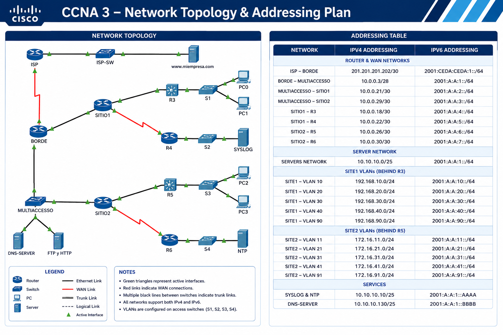

# 🌐 CCNA 3 — Enterprise Network Implementation

## Cisco Networking Academy — Practical Networking Laboratory

**IPv4 • IPv6 • VLANs • EtherChannel • HSRP • DHCP • Static Routing • Layer 2 Security • Cisco IOS**

---

## 📌 Overview

This project implements a multi-site enterprise network using **Cisco Packet Tracer**.

The laboratory demonstrates enterprise switching, routing, redundancy, IPv4/IPv6 dual-stack connectivity, VLAN segmentation, DHCP services, EtherChannel, and Layer 2 security.

---

## 🗺️ Network Topology



---

## 🧩 Network Architecture

### Core Network
- ISP connectivity
- Border router
- Redundant WAN paths
- Static and floating static routing

### SITE1
- Router-on-a-Stick
- VLANs 10, 20, 30, 40 and 90
- IPv4 DHCP
- Stateless DHCPv6
- 802.1Q trunking
- LACP EtherChannel

### SITE2
- Layer 3 switching
- VLANs 11, 21, 31, 41 and 91
- SVI-based Inter-VLAN Routing
- Stateful DHCPv6
- PAgP EtherChannel
- Rapid-PVST+

### Server Network
- DNS
- SYSLOG
- NTP
- FTP/HTTP services
- HSRPv2 gateway redundancy

---

## 📐 Addressing Plan

| Network | IPv4 | IPv6 |
|---|---|---|
| ISP – Border | 201.201.201.200/30 | 2001:CEDA:CEDA:1::/64 |
| Core Links | 10.0.1.0/28 | 2001:A:A::/64 |
| Servers | 10.0.0.0/24 | 2001:A:A:1::/64 |
| SITE1 VLAN 10 | 192.168.10.0/24 | 2001:A:A:10::/64 |
| SITE1 VLAN 20 | 192.168.20.0/24 | 2001:A:A:20::/64 |
| SITE1 VLAN 30 | 192.168.30.0/24 | 2001:A:A:30::/64 |
| SITE1 VLAN 40 | 192.168.40.0/24 | 2001:A:A:40::/64 |
| SITE1 VLAN 90 | 192.168.90.0/24 | 2001:A:A:90::/64 |
| SITE2 VLAN 11 | 172.16.11.0/24 | 2001:A:A:11::/64 |
| SITE2 VLAN 21 | 172.16.21.0/24 | 2001:A:A:21::/64 |
| SITE2 VLAN 31 | 172.16.31.0/24 | 2001:A:A:31::/64 |
| SITE2 VLAN 41 | 172.16.41.0/24 | 2001:A:A:41::/64 |
| SITE2 VLAN 91 | 172.16.91.0/24 | 2001:A:A:91::/64 |

---

# ⚙️ Key Configurations

## VLANs

```cisco
vlan 10
 name Administrativos

vlan 20
 name Ventas

vlan 30
 name Mercadeo

vlan 40
 name Voz

vlan 90
 name Nativa
🔗 Trunking
switchport mode trunk
switchport trunk native vlan 90
switchport trunk allowed vlan 10,20,30,40,90
switchport nonegotiate
⚡ LACP EtherChannel
Used between SITE1 access switches.
interface range FastEthernet0/1-5
 channel-group 1 mode active
Verification:
show etherchannel summary
⚡ PAgP EtherChannel
Used in SITE2.
! S3
channel-group 1 mode desirable

! S4
channel-group 1 mode auto
🔄 HSRPv2
R2 and R3 provide gateway redundancy for the server network.
standby version 2
standby 4 ip 10.0.0.1
standby 6 ipv6 FE80::1
Verification:
show standby brief
🌐 DHCP
DHCPv4
ip dhcp pool VLAN10
 network 192.168.10.0 255.255.255.0
 default-router 192.168.10.1
 dns-server 10.0.0.10
 domain-name miempresa.com
Stateless DHCPv6
ipv6 dhcp pool SINESTADO
 dns-server 2001:A:A:1::AAAA
 domain-name miempresa.com
ipv6 dhcp server SINESTADO
ipv6 nd other-config-flag
Stateful DHCPv6
ipv6 dhcp pool VLAN11
 address prefix 2001:A:A:11::/64
 dns-server 2001:A:A:1::AAAA
 domain-name miempresa.com
🧭 Routing
The network uses:
- IPv4 static routing
- IPv6 static routing
- Floating static routes
- Default routes
- Router-on-a-Stick
- Layer 3 SVI routing
Floating routes use a higher administrative distance to provide backup connectivity.
Example:
ip route 192.168.0.0 255.255.192.0 <primary-path>
ip route 192.168.0.0 255.255.192.0 <backup-path> 5
🔐 Layer 2 Security
Access switches implement:
switchport port-security
switchport port-security maximum 5
switchport port-security mac-address sticky
switchport port-security violation restrict
Additional protections:
spanning-tree portfast
spanning-tree bpduguard enable
switchport nonegotiate
Unused interfaces are administratively disabled:
interface range FastEthernet0/3-24
 shutdown
🌳 Spanning Tree
Rapid-PVST+ is implemented on the access layer.
spanning-tree mode rapid-pvst
spanning-tree portfast default
🔎 Verification
The following commands were used to validate the implementation:
show ip interface brief
show ipv6 interface brief
show vlan brief
show interfaces trunk
show etherchannel summary
show spanning-tree
show standby brief
show ip route
show ipv6 route
show ip dhcp binding
show ipv6 dhcp binding
show port-security
Connectivity testing:
ping <destination>
traceroute <destination>
traceroute ipv6 <destination>
🎯 Skills Demonstrated
Area	Technologies
Switching	VLANs, 802.1Q, Trunking
EtherChannel	LACP, PAgP
Routing	IPv4/IPv6 Static Routing
Redundancy	HSRPv2, Floating Routes
Inter-VLAN	Router-on-a-Stick, SVIs
DHCP	DHCPv4, Stateless/Stateful DHCPv6
STP	Rapid-PVST+, PortFast, BPDU Guard
Security	Port Security, Sticky MAC, DTP Control
IPv6	Dual-Stack, Link-Local, Global Unicast
Services	DNS, NTP, SYSLOG, FTP/HTTP


🧪 Troubleshooting Methodology
1. Physical connectivity
2. Interface status
3. VLAN configuration
4. Trunking
5. EtherChannel
6. STP
7. IP addressing
8. HSRP
9. Routing
10. DHCP
11. End-to-end connectivity
🛠️ Technologies
Cisco IOS
Cisco Packet Tracer
IPv4
IPv6
VLAN
802.1Q
LACP
PAgP
Rapid-PVST+
HSRPv2
DHCPv4
DHCPv6
Static Routing
Floating Static Routing
Port Security
BPDU Guard
PortFast
Router-on-a-Stick
Layer 3 Switching
🎓 Certification Context
Course: Cisco Networking Academy — CCNA
Module: Enterprise Networking / Switching & Routing
Environment: Cisco Packet Tracer 8.x
Focus: Enterprise Network Implementation
👨‍💻 Author
CCNA Networking Laboratory — Enterprise Network Implementation
Hands-on implementation of a redundant, dual-stack enterprise network using Cisco IOS technologies.
